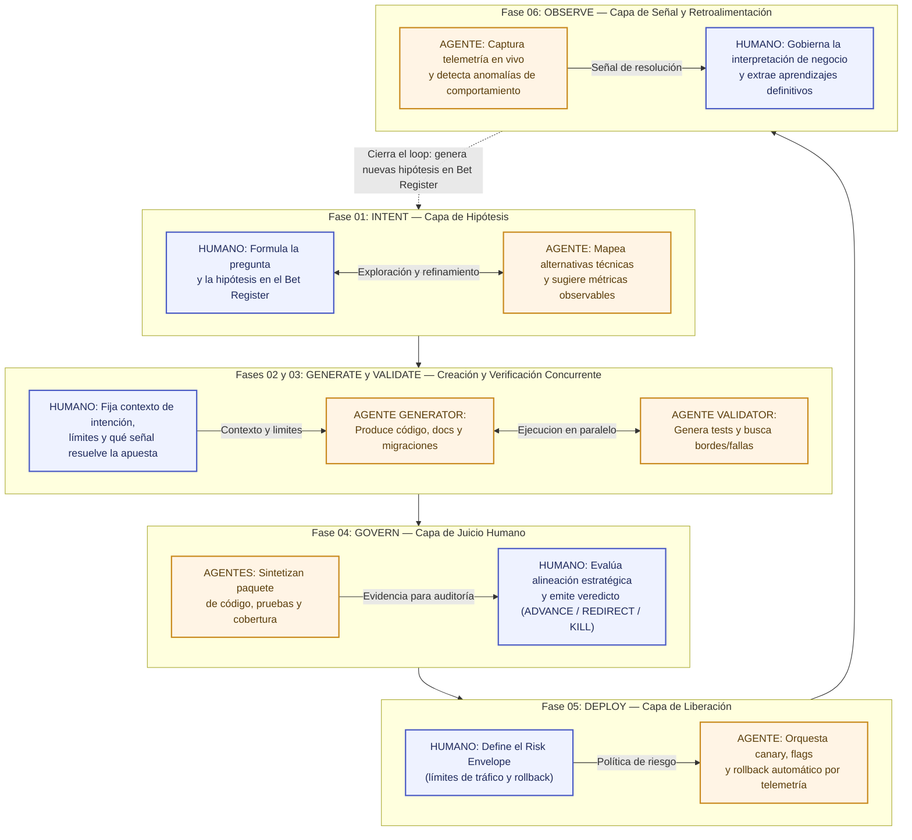
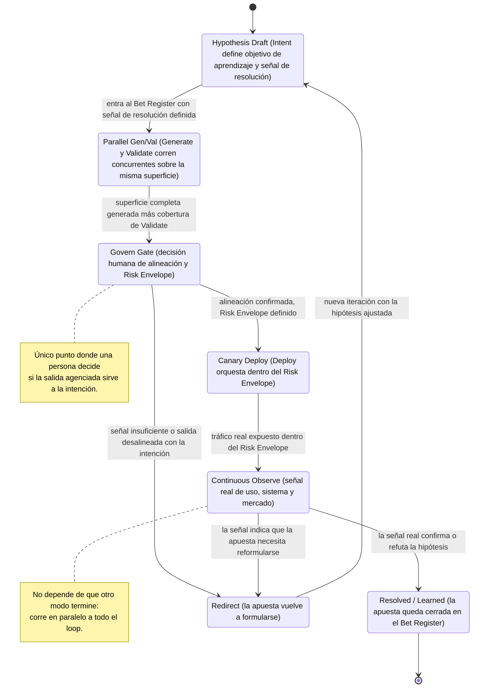
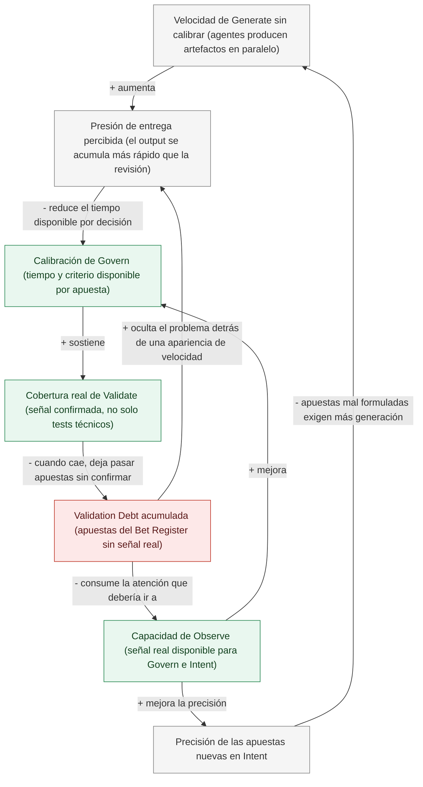

# 02 · Infografías y Diagramas del ADLC

> Este documento traduce a diagramas los conceptos desarrollados en [`01-Fundamentos-y-Manifiesto.md`](01-Fundamentos-y-Manifiesto.md). Donde ese documento explica en prosa por qué el modelo está construido así, este documento lo hace visible: cuatro infografías en Mermaid, pensadas para leerse solas —en una revisión ejecutiva, en una sesión de onboarding, proyectadas en una pantalla— sin necesitar el resto del kit al lado. Todos los diagramas usan comillas dobles dentro de los corchetes de cada nodo (`id["Texto"]`) para que el acentuado y la puntuación no rompan el parseo en Obsidian ni en GitHub, y fueron validados con el renderer oficial de Mermaid antes de publicarse.

Cada infografía sigue la misma estructura: una introducción que explica qué problema resuelve el diagrama, el diagrama en sí, una guía de lectura elemento por elemento, y un cierre sobre las implicancias prácticas de tomarse en serio lo que el diagrama muestra.

## 1. Pipeline Lineal (SDLC) vs. Loop Concurrente (ADLC)

La diferencia estructural más básica entre los dos modelos no es de vocabulario, es de forma. El SDLC es una **cascada**: el trabajo entra por un extremo, atraviesa silos especializados uno a la vez, y cada transición entre silos está protegida por un gate que congela el trabajo hasta que alguien lo aprueba. El ADLC es un **loop**: las seis fases —Intent, Generate, Validate, Govern, Deploy, Observe— no son paradas de una cascada sino modos que corren en simultáneo, con la salida de Observe realimentando directamente a Intent para cerrar el ciclo. El diagrama pone ambas formas una al lado de la otra, con el mismo nivel de detalle, para que la comparación no dependa de la memoria de quien lo mira.

```mermaid
flowchart TB
    subgraph SDLC["SDLC: Pipeline Lineal (silos secuenciales)"]
        direction LR
        REQ["Requerimientos (silo: Analista)"]
        DIS["Diseño (silo: Arquitecto)"]
        DEV["Desarrollo (silo: Developer)"]
        QA["Prueba (silo: QA)"]
        DEP["Despliegue (silo: Ops)"]
        MANT["Mantenimiento (silo: Soporte)"]
        REQ -->|"gate: aprobación de alcance"| DIS
        DIS -->|"gate: aprobación de diseño"| DEV
        DEV -->|"gate: code freeze"| QA
        QA -->|"gate: sign-off de calidad"| DEP
        DEP -->|"gate: ventana de release"| MANT
    end

    subgraph ADLC["ADLC: Loop Concurrente (retroalimentación continua)"]
        direction LR
        INT["Intent (Bet Register)"]
        GEN["Generate (superficie completa en paralelo)"]
        VAL["Validate (señal real, concurrente con Generate)"]
        GOV["Govern (decisión de alineación humana)"]
        DPL["Deploy (Risk Envelope)"]
        OBS["Observe (señal continua)"]

        INT -->|"objetivo de generación"| GEN
        GEN <-->|"concurrente: misma superficie de cambio"| VAL
        GEN -->|"expone salida"| GOV
        VAL -->|"expone señal real"| GOV
        GOV -->|"define límites"| DPL
        DPL -->|"tráfico real expuesto"| OBS
        OBS -->|"hipótesis nueva"| INT
    end

    classDef silo fill:#eee,stroke:#999,color:#333
    classDef loop fill:#e8f4ff,stroke:#3b82c4,color:#0b3d59
    class REQ,DIS,DEV,QA,DEP,MANT silo
    class INT,GEN,VAL,GOV,DPL,OBS loop
```

**Cómo leer este diagrama.** El subgrafo superior (gris) tiene una sola dirección de flujo, con un gate nombrado en cada flecha: eso significa que el trabajo se detiene ahí hasta que alguien —una persona específica, en un rol específico— lo aprueba. El subgrafo inferior (azul) tiene dos rasgos que no existen arriba: una flecha doble entre Generate y Validate, porque esas dos fases corren sobre el reloj al mismo tiempo y no una después de la otra, y una flecha que cierra el ciclo desde Observe de regreso a Intent, porque el ciclo no termina en Deploy, se retroalimenta indefinidamente. Ningún nodo del loop tiene un gate nombrado en su flecha de salida porque la fase siguiente no espera una aprobación puntual: opera dentro de límites ya definidos por Govern en Deploy, o recibe señal continua en vez de una revisión puntual.

**Por qué importa en la práctica.** El error de adopción más común es tomar las seis fases de ADLC y dibujarlas como si fueran el mismo pipeline de seis casilleros del SDLC, solo que más rápido porque hay un agente adentro de cada casillero. Ese es exactamente el diagrama de arriba, no el de abajo — y la diferencia no es cosmética: un equipo que opera el loop como si fuera un pipeline va a seguir teniendo colas de aprobación entre "Generate" y "Govern" aunque llame a esas etapas con nombres de ADLC, porque la estructura que sostiene el trabajo sigue siendo secuencial. La señal de que el loop de abajo está realmente en operación, y no solo nombrado, es que Generate y Validate producen evidencia de estar corriendo en simultáneo —cobertura de pruebas que llega con el código, no después— y que Observe efectivamente escribe hipótesis nuevas en el Bet Register sin que nadie tenga que pedirlo.

## 2. Matriz de Coexistencia: Agente Ejecuta / Humano Gobierna

ADLC no es "los agentes hacen todo y los humanos miran". Es una redistribución precisa de responsabilidades dentro de cada una de las seis fases: en cada una, el agente ejecuta un tipo de trabajo técnico o de telemetría y el humano gobierna una decisión estratégica o fija un límite de contexto.

La infografía estructura esta coexistencia fase por fase: cada contenedor representa una fase del ciclo ADLC, dentro del cual conviven el **rol humano (cuadros azules)** y el **rol del agente (cuadros naranja)**, mostrando el intercambio directo entre ambos y cómo el ciclo se retroalimenta.

### ¿Qué representa cada cuadro en el diagrama?

| Contenedor / Fase | Cuadro Azul (Humano: Gobernanza) | Cuadro Naranja (Agente: Ejecución) | Dinámica de Colaboración |
|---|---|---|---|
| **01. INTENT** | **Formula la pregunta**: Redacta la hipótesis en el Bet Register con qué se busca aprender. | **Mapea opciones**: Investiga el espacio técnico, propone alternativas de diseño y riesgos. | Co-diseño iterativo: el humano define la duda de negocio y el agente ayuda a aterrizarla. |
| **02. GENERATE & 03. VALIDATE** | **Define contexto y límites**: Fija la arquitectura y qué señal empírica resolverá la apuesta. | **Ejecutan en simultáneo**: *Generator* crea código/docs y *Validator* crea tests/adversarios. | El humano no pica código: define las restricciones y deja que los dos agentes corran a la par. |
| **04. GOVERN** | **Veredicto formal**: Decide `ADVANCE`, `REDIRECT` o `KILL` según valor y contexto externo. | **Sintetiza evidencia**: Empaqueta el diff, métricas de cobertura y reporte de riesgos. | El agente prepara el informe; el humano ejerce la responsabilidad que la IA no puede asumir. |
| **05. DEPLOY** | **Fija el Risk Envelope**: Establece umbrales de tráfico seguro y alarmas de rollback. | **Orquesta el release**: Aplica canaries, banderas de funcionalidad y reversión automática. | El humano define los límites de seguridad una sola vez; el agente opera los despliegues. |
| **06. OBSERVE** | **Interpreta la señal**: Evalúa si el resultado valida la hipótesis y extrae lecciones. | **Monitorea telemetría**: Mide métricas reales en producción y detecta desvíos o anomalías. | El agente extrae los datos continuos; el humano decide si la apuesta se cierra o si nace una nueva. |

**Cómo leer este diagrama.** Cada contenedor agrupa una fase operativa. Dentro de cada una, el color azul identifica siempre la intervención y responsabilidad humana (criterio, límites, evaluación), mientras que el color naranja identifica el trabajo autónomo del agente (generación, verificación, monitoreo). La flecha punteada final que vuelve desde Observe hasta Intent es la que convierte la entrega en un loop continuo en lugar de un pipeline cerrado.

**Por qué importa en la práctica.** Esta matriz es la herramienta de diagnóstico más rápida para auditar si un equipo realmente opera ADLC o solo usa su vocabulario. Tomá cualquier fase de tu proceso actual y preguntá: ¿qué hace acá el agente, y qué hace acá el humano, específicamente? Si la respuesta para el humano es "revisa lo que hizo el agente" en las seis fases por igual, sin distinción entre "define el límite antes" y "decide sobre el resultado después", el carril humano está funcionando como una sola actividad genérica de supervisión, no como seis tipos de gobernanza distintos y deliberados. Y si la respuesta para el agente es la misma en las seis fases ("genera código"), el carril agenciado tampoco está diferenciado por fase, lo cual suele significar que el agente solo está operando en Generate y el resto de las fases siguen siendo enteramente manuales con una etiqueta de ADLC encima.

## 3. Máquina de Estados del Ciclo de Vida de una Bet

Una entrada del Bet Register no es un ticket que se mueve de "por hacer" a "hecho". Es una hipótesis que atraviesa una secuencia de estados bien definidos, con dos puntos de decisión explícitos —uno en Govern, uno en Observe— desde los cuales puede avanzar, resolverse o volver atrás para reformularse. Esta infografía modela ese ciclo de vida como una máquina de estados, que es la forma más precisa de representarlo porque cada transición tiene una condición de entrada concreta, no una fecha de calendario.

**Cómo leer este diagrama.** El estado inicial, `Hypothesis Draft`, es donde vive Intent: una apuesta no entra a la máquina de estados hasta que tiene un objetivo de aprendizaje y una señal de resolución definidos, no solo una idea. `Parallel Gen/Val` es un único estado, no dos, porque Generate y Validate no son etapas separadas de la máquina: son un mismo estado donde dos procesos corren a la vez sobre la misma superficie de cambio. `Govern Gate` es el primer punto de bifurcación real: desde ahí la máquina puede avanzar a `Canary Deploy` o retroceder a `Redirect` — y notá que `Redirect` no vuelve a `Parallel Gen/Val`, vuelve a `Hypothesis Draft`, porque una salida desalineada casi siempre significa que la pregunta estaba mal formulada, no que la ejecución estuvo mal hecha. `Continuous Observe` es el segundo punto de bifurcación, y es el único estado del que se puede salir hacia `Resolved` (la apuesta se cierra con una respuesta real) o hacia `Redirect` otra vez (la señal real, ya en producción, todavía no alcanza para resolver la hipótesis tal como está planteada).

**Por qué importa en la práctica.** Las dos transiciones que casi ningún equipo instrumenta explícitamente son las que llevan a `Redirect`. Es fácil dibujar el camino feliz —de `Hypothesis Draft` a `Resolved` en línea recta— y mucho más raro que un Bet Register real tenga un campo que registre, de forma visible, cuántas apuestas volvieron de `Govern Gate` o de `Continuous Observe` hacia atrás, y por qué. Esa falta de registro no es un detalle menor: es exactamente el punto ciego donde se esconde la Validation Debt, porque una apuesta que debería haber vuelto a `Hypothesis Draft` desde `Continuous Observe` pero que en la práctica se deja "en producción, sin resolver, sin nadie mirándola de nuevo" es una apuesta que salió de la máquina de estados sin pasar por ninguno de sus dos estados finales reales.

## 4. Dinámica Sistémica de la Deuda de Validación (Validation Debt Trap)

Las tres infografías anteriores muestran estructura: cómo se organiza el trabajo, quién hace qué, por qué estados pasa una apuesta. Esta última muestra **dinámica**: qué pasa a lo largo del tiempo cuando una organización adopta la velocidad de Generate sin construir, al mismo ritmo, la capacidad de Govern y de Validate que esa velocidad exige. No es un diagrama de flujo de un proceso, es un diagrama causal: cada flecha indica que una variable influye sobre otra, con un signo (`+` la mueve en el mismo sentido, `-` la mueve en sentido contrario), y las flechas se cierran en ciclos que se refuerzan a sí mismos.

**Cómo leer este diagrama.** Seguí el ciclo principal empezando en `Velocidad de Generate`: más velocidad de generación aumenta la `Presión de entrega percibida`, esa presión reduce el tiempo real que Govern tiene disponible para calibrar cada decisión (`Calibración de Govern`), una calibración más pobre sostiene menos `Cobertura real de Validate`, y cuando esa cobertura cae, más apuestas quedan sin señal real confirmada, lo cual es exactamente la definición de `Validation Debt`. El ciclo se cierra —y se refuerza a sí mismo— porque esa deuda acumulada *oculta* el problema en lugar de exponerlo: el sistema sigue produciendo output a buen ritmo, así que la presión de entrega percibida no baja, sube, porque nada en la superficie visible del proceso señala que algo está mal. Hay un segundo ciclo, más lento pero igual de dañino, que sale de `Validation Debt` hacia `Capacidad de Observe`: la deuda consume la atención que debería dedicarse a interpretar señal real, una `Observe` debilitada reduce la `Precisión de las apuestas nuevas en Intent` (las hipótesis se formulan con menos evidencia), y apuestas peor formuladas exigen todavía más generación exploratoria para compensar, lo cual realimenta el ciclo desde el principio.

**Por qué importa en la práctica.** Este diagrama tiene tres nodos verdes —`Calibración de Govern`, `Cobertura real de Validate`, `Capacidad de Observe`— que no son síntomas sino capacidades organizacionales: cuanto más fuertes son, menos espacio tiene la trampa para reforzarse. De las tres, `Capacidad de Observe` es la palanca con más apalancamiento, porque no solo sostiene a `Calibración de Govern` dentro del ciclo principal, sino que además es el único nodo que abre el segundo ciclo hacia `Intent`: una inversión deliberada ahí —construir instrumentación real, dedicar tiempo humano a interpretar señal en vez de solo generarla— empuja la flecha `+ mejora` en sentido contrario al de la trampa, rompiendo el refuerzo en lugar de alimentarlo. Es también la razón por la que "generar más rápido" nunca es la respuesta a la Validation Debt, aunque intuitivamente parezca que producir más compensa lo que falta: cualquier intervención que solo actúe sobre el nodo `Velocidad de Generate` —ya sea acelerándolo o frenándolo— dejá el resto del ciclo intacto, mientras que una intervención sobre `Capacidad de Observe` o sobre `Calibración de Govern` corta la trampa en su origen. Un diagnóstico rápido para saber si tu organización ya está atrapada en este ciclo: si nadie puede nombrar, para las últimas apuestas resueltas, qué señal real las confirmó —tal como se describe en el principio de Señal sobre suposición en `01-Fundamentos-y-Manifiesto.md`—, el ciclo reforzador ya está en marcha, esté o no siendo nombrado como tal.
